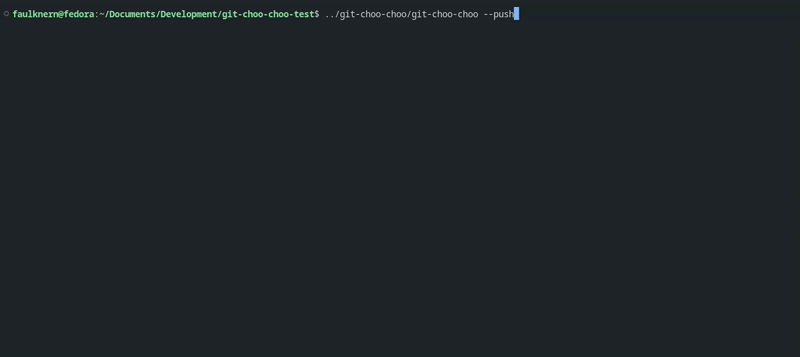

# Git-Choo-Choo

> "Push the code... Choo-choo!" – Me, tired during overtime



Git-Choo-Choo is a lighthearted terminal utility, spawned from working multiple overtime shifts. 

Animates an ASCII train across your terminal, carrying your locally committed changes, upon completion pushing your code to the branch. Inspired by [SL](https://github.com/mtoyoda/sl). 


## Configuration & Flags

| Flag       | Description                                                                               | Default                |
| ---------- | ----------------------------------------------------------------------------------------- | ---------------------- |
| `--push`   | Automatically pushes the code after the animation finishes.                               | `true`                |
| `--remote` | Sets the remote name to push to               | `origin`               |
| `--branch` | Sets the local branch to push. If omitted, the current working branch is used.            | `Current working branch` |
| `--force`  | Force pushes the branch to the remote. **Use with caution:**  | `false`                |
| `--speed`  | Adjusts the train animation speed. Lower numbers make the train move faster.              | `40`                   |

## Installation

### Build from source

Make sure you have Go installed (1.18+ recommended):

```bash
git clone https://github.com/yourusername/git-choo-choo.git
cd git-choo-choo
go build -o git-choo-choo
```

Then move that binary into your PATH variables. Then run in your terminal 

`git-choo-choo`

## Contributing

Want to add another train model? An explosion when it hits a merge conflict? Found a bug in the code? Any PRs or Issues are welcome.

## License

[MIT](./LICENSE). Just don’t blame me if your train *derails* and wrecks your git repository.  

## FAQ

### Why is it a train and not a ship for “Ship the code”?

That’s a better and funnier joke than we came up with while on overtime. Maybe a future flag option...

### Why would anyone use this?

It’s an impractical and silly program. It’s not meant to be taken seriously. If you smile while pushing code, mission accomplished.

### Can I use this in a CI/CD tool?

It's untested and probably will break due to the curses/tcell animation, but technically, yes. I would like to see if people can get it working especially within a full GitOps Workflow.

### Why Go? Wouldn’t a Bash script been easier/more practical?

I like Go. 
