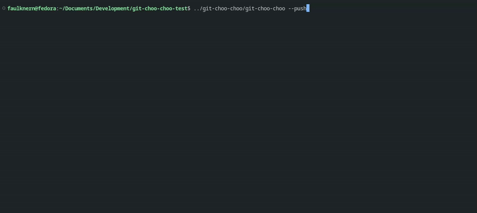

# Git-Choo-Choo

**Git-Choo-Choo** is the train your git commits have been waiting for. Inspired by the legendary [sl](https://github.com/mtoyoda/sl) (Steam Locomotive) terminal command. This Go-powered CLI tool carries your locally committed changes to your remote repository - aboard an ASCII steam locomotive.



## What Is This?

> "Push the code... Choo-choo!" – Me, tired during overtime

Git-Choo-Choo is a **fun novality project**, spawned from working multiple overtime shifts:

- Animates an ASCII train across your terminal,
- "Picks up" your locally committed changes,
- And "carries" them to your remote branch with a satisfying **choo-choo**.

## Configuration & Flags

| Flag       | Description                                                                               | Default                |
| ---------- | ----------------------------------------------------------------------------------------- | ---------------------- |
| `--push`   | Automatically pushes the code after the animation finishes.                               | `false`                |
| `--remote` | Sets the remote name. Typically `origin`, but can be any configured remote.               | `origin`               |
| `--branch` | Sets the local branch to push. If omitted, the current working branch is used.            | Current working branch |
| `--force`  | Force pushes the branch to the remote. ⚠️ **Warning:** This can overwrite commit history. | `false`                |
| `--speed`  | Adjusts the train animation speed. Lower numbers make the train move faster.              | `40`                   |

## ⚙️ Installation

### Build from source

Make sure you have Go installed (1.18+ recommended):

```bash
git clone https://github.com/yourusername/git-choo-choo.git
cd git-choo-choo
go build -o git-choo-choo
```

Then move that binary/executable into your PATH variables. then simply run in your CLI

`git-choo-choo`

## Contributing

Want to add another train model? An explosion when it hits a merge conflict? Found a bug in the code? PRs or Issues are welcome.

## License

[MIT](./LICENSE). Free to use, modify, and distribute however you want... just don’t blame me if your train *derails* and wrecks your git repository.  

## FAQ

### Why is it a train and not a ship for “Ship the code”?

That’s a better and funnier joke than we came up with while on overtime. Maybe a future flag option...

### Why would anyone use this?

It’s an impractical and silly program. It’s not meant to be taken seriously. If you smile while pushing code, mission accomplished.

### Can I use this in a CI/CD tool?

It's untested and possibly problematic due to the curses/tcell animation, but technically, yes. I would like to see if people get it working especially within a full GitOps Workflow.

### Why Go? Wouldn’t a Bash script been easier/more practical?

Honestly? I wanted Go practice.
